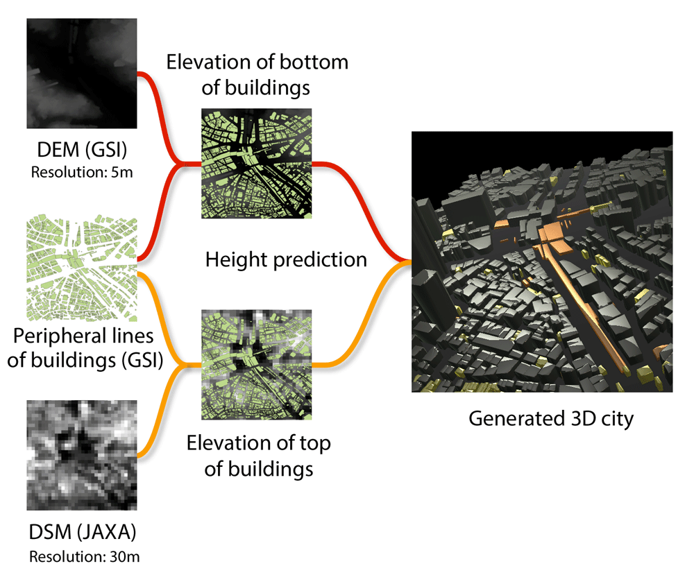

# 3D city generator

Demo: https://knt5.github.io/demo/city-generator/


- This is a tech demo to predict height of buildings in real time on web browser and generate 3D city.
- The height prediction is based on elevation data (DSM) recoded by Advanced Land Observing Satellite "[DAICHI](http://global.jaxa.jp/projects/sat/alos/index.html)" (ALOS) of JAXA.
- The demo also uses building peripheral lines and elevation data without height of buildings (DEM) by GSI (Geospatial Information Authority of Japan).



Japanese:

- ビルの高さ推定をブラウザ上でリアルタイムに行い 3D 市街地を構築するデモです。
- JAXA の陸域観測技術衛星「[だいち](http://www.jaxa.jp/projects/sat/alos/index_j.html)」(ALOS) による標高データ(DSM)をベースに高さ推定を行っています。
- この他に国土地理院の建物外周線データと、ビル高さなし標高データ(DEM)を使用しています。

## Build development enviroment

```
# node.js ^6.2.1
gem install sass
npm install -g gulp
npm install
```
